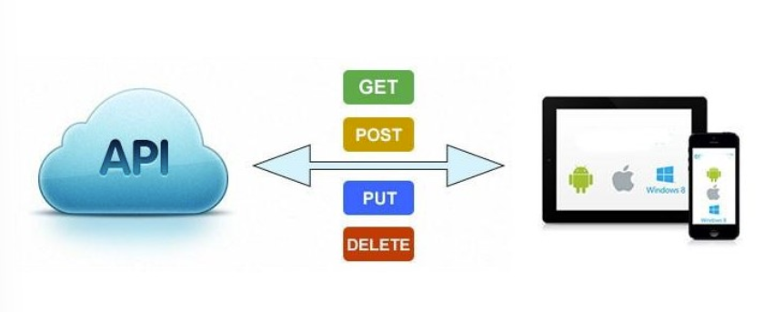
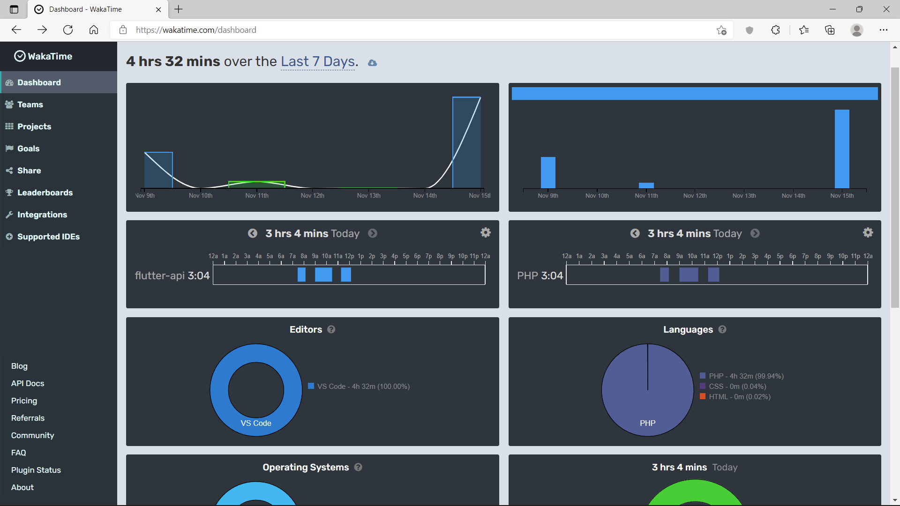
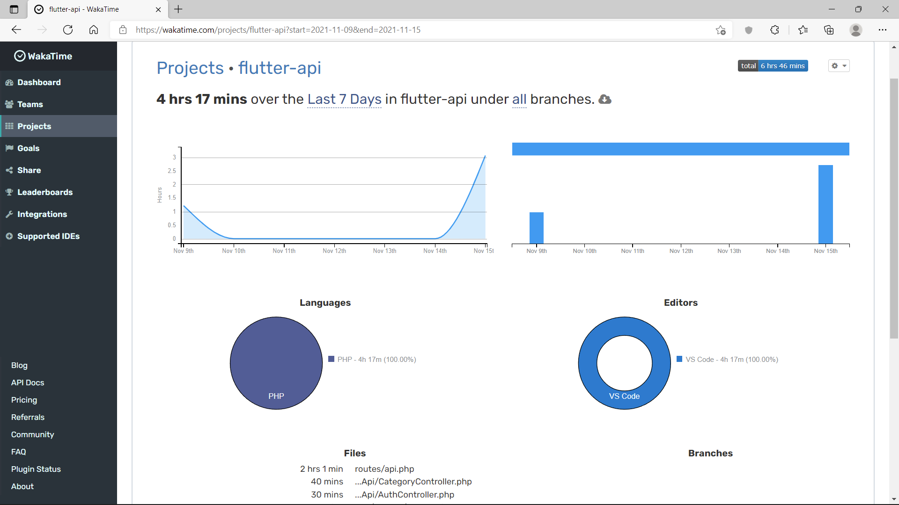

## Pertemuan 10 

## Mengerjakan Flutter-Api

Pada pertemuan 10 ini saya mengerjakan berdasarkan tutorial yang ada di video. Berdasarkan tutorial tersebut saya masih mempelajari sampai dengan video ke-8. 
Materi di video ini yaitu materi mengenai Restful Api. 

1. membuat project baru dengan nama flutter-api
2. membuat database dengan nama flutter-api
3. membuat tabel categories
4. melakukan migrate
5. membuat model dan controller resource
6. mengisikan data menggunakan php artisan tinker
7. membuat route pada api.php
8. menambahkan 1 tabel lagi dengan nama transaction 
9. sama seperti sebelumnya mengisikan data menggunakan php artisan tinker 
10. untuk pengecekan menggunakan postman 

## Restful Api
ARESTful API / REST API merupakan implementasi dari API (Application Programming Interface). REST (Representional State Transfer) adalah suatu arsitektur metode komunikasi yang menggunakan protokol HTTP untuk pertukaran data dan metode ini sering diterapkan dalam pengembangan aplikasi. Dimana tujuannya adalah untuk menjadikan sistem yang memiliki performa yang baik, cepat dan mudah untuk di kembangkan (scale) terutama dalam pertukaran dan komunikasi data.

## RESTFUL API memiliki 4 komponen penting di dalamnya diantaranya adalah

## URL Design
RESTful API diakses menggunakan protokol HTTP. Penamaan dan struktur URL yang konsisten akan menghasilkan API yang baik dan mudah untuk dimengerti developer. URL API biasa disebut endpoint dalam pemanggilannya.

## HTTP Verbs
Setiap request yang dilakukan terdapat metode yang dipakai agar server mengerti apa yang sedang di request client

- GET
GET adalah metode HTTP Request yang paling simpel, metode ini digunakan untuk membaca atau mendapatkan data dari sumber.
- POST
POST adalah metode HTTP Request yang digunakan untuk membuat data baru dengan menyisipkan data dalam body saat request dilakukan.
- PUT
PUT adalah metode HTTP Request yang biasanya digunakan untuk melakukan update data resource.
- DELETE
DELETE adalah metode HTTP Request yang digunakan untuk menghapus suatu data pada resource.

## HTTP Response Code
HTTP response code adalah kode standarisasi dalam menginformasikan hasil request kepada client. Secara umum terdapat 3 kelompok yang biasa kita jumpai pada RESTful API yaitu :

- 2XX : adalah response code yang menampilkan bahwa request berhasil.
- 4XX : adalah response code yang menampilkan bahwa request mengalami kesalahan pada sisi client.
- 5XX : adalah response code yang menampilkan bahwa request mengalami kesalahan pada sisi server.

## Format Response
Setiap request yang dilakukan client akan menerima data response dari server, response tersebut biasanya berupa data XML ataupun JSON. Setelah mendapatkan data response tersebut barulah client bisa menggunakannya dengan cara memparsing data tersebut dan diolah sesuai kebutuhan.

## Cara REST APIs bekerja
API secara eksplisit memanfaatkan metodologi HTTP yang ditentukan oleh protokol RFC 2616. Permintaan ke API bisa menggunakan GET untuk mengambil sumber daya, PUT untuk mengubah status atau memperbarui sumber daya, yang dapat berupa objek, file, atau blok, POST untuk membuat sumber daya itu, dan DELETE untuk menghapusnya.

API dapat dikatakan “RESTful” jika memiliki fitur berikut :

Client – server : Client menangani front end dan server menangani back end dan keduanya dapat diganti secara independen satu sama lain.

Stateless : Tidak ada data klien yang disimpan di server ketika ada permintaan dan status sesi disimpan di klien.

Cacheable : Klien dapat men-cache respon (seperti browser yang men-cache elemen statis halaman web) untuk meningkatkan kinerja.

## Dashboard Wakatime 

## Lamanya Pengerjaan Project Flutter-api

