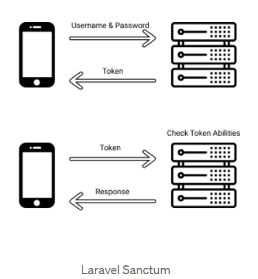

## Pertemuan 11 

## Melanjutkan Mengerjakan Flutter-Api

Pada pertemuan 11 ini saya melanjutkan mengerjakan berdasarkan tutorial yang ada di video. Berdasarkan tutorial tersebut saya masih melanjutkan video 8-12 
Materi di video ini yaitu materi mengenai penggunaan sanctum dan token untuk login. 

1. membuat project baru dengan nama flutter-api
2. membuat database dengan nama flutter-api
3. membuat tabel categories
4. melakukan migrate
5. membuat model dan controller resource
6. mengisikan data menggunakan php artisan tinker
7. membuat route pada api.php
8. menambahkan 1 tabel lagi dengan nama transaction 
9. sama seperti sebelumnya mengisikan data menggunakan php artisan tinker 
10. untuk pengecekan menggunakan postman 
11. menambahkan Auth Controller
12. menambahkan relasi pada tabel
13. mengganti route get dengan route group 
14. menambahkan route untuk login dan register


## Laravel Sanctum
Laravel Sanctum adalah salah satu first-party laravel yang bertujuan untuk memudahkan mobile developer dan juga frontend-js developer untuk membuat autentikasi pada aplikasi. Laravel Sanctum berbasis token dan membolehkan 1 user memiliki beberapa token yang memiliki kemampuanyang berbeda.



Gambaran penggunaan Laravel Sanctum adalah seperti di atas. Aplikasi mendapatkan token dari Backend dengan login username password lalu backend akan mengembalikan response berupa token.
Setelah itu aplikasi dapat menggunakan token untuk membuat request untuk mengakses data pada server, tentunya data disini terbatas sesuai kemampuan token.

## Cara Install Laravel sanctum
Untuk menginstall Laravel Sanctum dimulai dari menambahkan package laravel/sanctum dengan

```java 
composer require laravel/sanctum
```
selanjutnya publish config dari Sanctum

```java 
php artisan vendor:publish --provider="Laravel\Sanctum\SanctumServiceProvider"
```

Lakukan migrasi database dengan 

```java
php artisan migrate
``` 
karena Sanctum akan membuat satu tabel yang digunakan untuk menyimpan token

akan mendapat file baru pada config/sanctum.php

## Memebuat Api Token
Untuk membuat token pada backend, pertama kali yang harus kamu lekukan adalah menambahkan trait HasApiTokens pada model Sebagi contoh adalah User model

```java
use Laravel\Sanctum\HasApiTokens;

class User extends Authenticatable
{
    use HasApiTokens, HasFactory, Notifiable;
}
``` 

Jika sudah bisa membuat token dengan fungsi createToken

```java
$token = $user->createToken('token-name');

return $token->plainTextToken;
```

Kemudian bisa mengakses semua token yang sudah di generate oleh user

## Memproteksi Laravel Route
Untuk memproteksi routes supaya semua request yang datang di autentikasi kita harus menambahkan middleware auth:sanctum pada route yang kamu inginkan. Middleware ini akan memastikan bahwa request yang masuk memiliki token yang valid, jika tidak maka laravel akan secara otomatis menolak request tersebut

## Request pada aplikasi mobile dan SPA
Ketika aplikasi sudah mendapatkan token, maka yang harus di lakukan selanjutnya adalah menambahkan header authorization pada setiap kali request.

```java
authorization: Bearer <token>
accept: application/json
```
